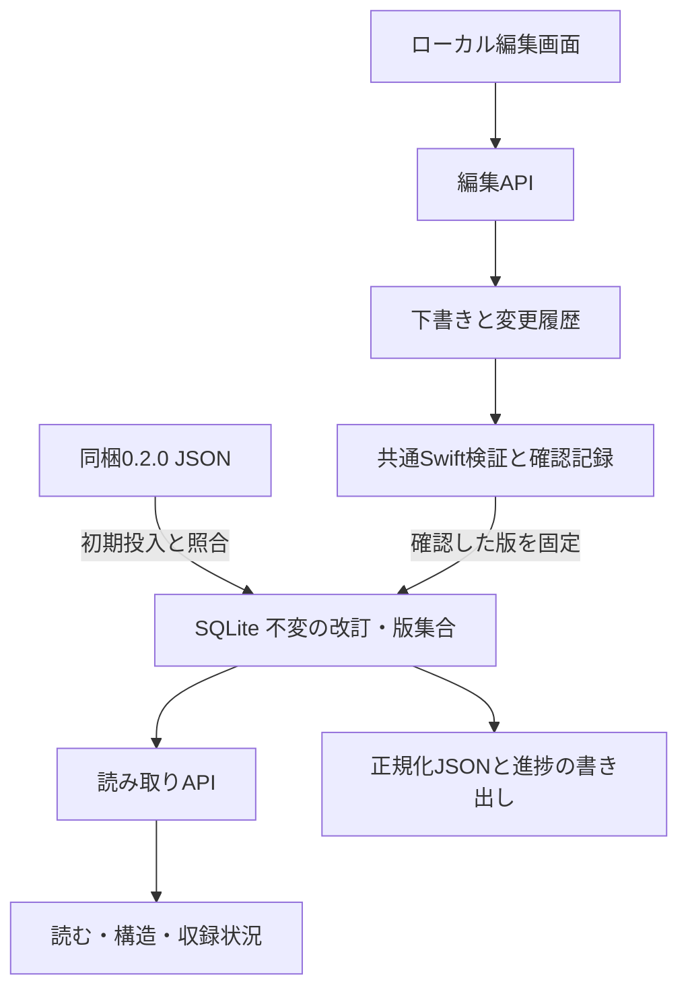

# DBと編集基盤の現状・移行方針

確認日：2026-10-11。ローカル編集はSQLiteで実装済みです。この文書は保存元の境界と今後の移行方針を示します。操作、テーブル、バックアップ手順は[ローカル編集](local-editing.md)を参照してください。

## 現在の保存元

| データ・起動方法 | 保存元と役割 |
|---|---|
| `make serve` | 同梱JSONを読む。編集はできない |
| `make serve-edit` の契約0.2.0データ | SQLiteが編集・閲覧の保存元。同梱JSONは初期投入・再現用 |
| 契約0.1.0の旧版 | 編集起動でも同梱JSONから読む。SQLite編集の対象外 |
| 教材試作 | 独立JSONから読む。教材編集のDB化は未実装 |
| Swiftの小標本 | モデル・契約・改訂操作を再現する入力。DB内の下書きと二重編集しない |
| 書き出した公開JSON・進捗記録 | 共有・配布・再現用。不変の版としてGitに追加できる |

`make export` はSwift小標本の再生成です。DBの編集結果は `manage_db.py export`、進捗は `export-work` で取り出します。

下書きもSQLiteに保存します。図の確認工程は新しい版を作る条件であり、下書き保存のたびに確認完了を要求するものではありません。

## 保存時に守る境界

- 原文と独自編集を分け、通常の編集で原文を上書きしません。再取り込み・訂正は取得版と差分を確認します。
- 対象UUIDと改訂UUIDを分け、不変のレコード改訂と採用した改訂の集合を保存します。旧版は後の編集で変えません。
- 根拠は対象のフィールドと原典の改訂へ固定します。編集後の引き継ぎは明示し、未確認の古い根拠が残る下書きは新しい版にできません。
- 保存・確認・版作成はトランザクション内で期待する下書き版を照合します。UUIDの発行だけで競合を解決したとは扱いません。
- 原典階層、対象と目標、前提式、目次、確認記録を独立した責務として維持します。

本文はJSON、同一性・改訂・版集合・検索属性はリレーショナルに保存しています。資料種別、AND/OR式、引用位置を自由文へ変換せず、契約0.2.0の意味を保ちます。外部キー・一意制約と不変性のトリガーを使い、再構成したJSONを共通Swiftモデルで検証します。DBの `user_version=2` と交換契約の `schemaVersion=0.2.0` は別の版です。

## 実装・確認したこと

同梱版の投入と書き戻し、再起動での保存、期待版による競合検出、版固定の確認、新しい不変版の作成、バックアップ復元を実装しています。国語「読むこと」の整理版と原文単位の部分進捗を、DBから書き出して閲覧専用起動でも再現しています。[編集の検証記録](reviews/local-editing.md)、[整理の検証記録](reviews/reading-authoring.md)。

現行の画面は対象・目標の新規作成と本文・条件・注釈・原文根拠の編集を扱います。任意の教育属性変更、外部資料の登録、関係・前提・分割統合の編集画面は未実装です。分割・統合は[Swiftの共通編集操作](identity-editing.md)で検証しています。

## 次の移行で決めること

[Issue #5](https://github.com/KantoYamamoto/Curricula/issues/5)で、教材・問題モデルと公開構成に合わせた保存設計を検討します。

| 条件・課題 | 検討方針（未決定） |
|---|---|
| 教材・問題を継続して編集する | 教材、問題、解答、図表の改訂と公開版集合を追加。現在の試作JSONとの変換を検証 |
| 複数人が編集する | 認証・役割・確認／版作成の権限、競合表示、編集履歴の扱いを設計 |
| 外部サービスへ配信する | 公開データの配信と編集の責務を分け、書き込み量・保存先・運用からDB構成を選ぶ |
| SQLiteで運用条件を満たせなくなる | 同時書き込み、ホスティング、復旧の条件を根拠に移行を判断。関係が多いことだけではDB製品を変更しない |

リレーショナルDBを出発点とし、必要な箇所で構造化JSONを保持する方針です。外部JSON契約をDB製品固有の型に合わせる必要はありません。具体的な製品変更や公開wiki運用は決まっていません。

移行時は旧版のバイト一致、ID・根拠・文脈・履歴の保持、未対応フィールドを黙殺しないこと、競合検出、バックアップ復元を確認します。移行前の入力とDBを保持し、切り替え先の検証後に保存元を変更します。

初期の未導入時の検討は[保存版](history/design-2026-09-28/database-editing-plan.md)にあります。
