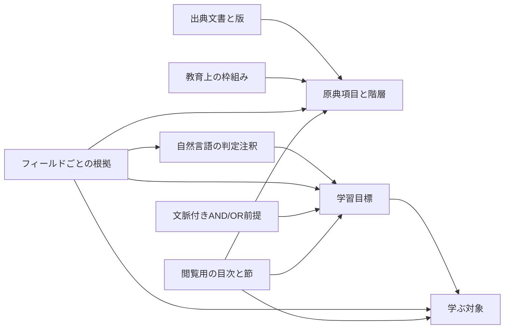

# ドメイン設計

確認日：2026-10-11。現在の中核は[交換契約0.2.0](exchange-contract-0.2.md)です。この文書は各要素の責務を説明します。フィールド・制約の定義は [SchemaV2.swift](../Sources/Curricula/SchemaV2.swift) と [ValidationV2.swift](../Sources/Curricula/ValidationV2.swift)を参照してください。

## 原文、学ぶ対象、目標を分ける

原文の要求や見出しは `frameworkItem`、学ぶ概念・手順などは `subjectMatter`、期待する行動や態度は `goal` として保持します。原文の一項目を必ず一目標に変換する制約はなく、複数の原文・対象・目標を対応付けられます。

図の矢印は参照関係を示します。原典階層、内容の対応、学習前提、閲覧順には別の意味があります。

## コレクションの責務

| コレクション | 保持するもの |
|---|---|
| `sources` | 指導要領・解説・書籍等の種類、書誌、原典版、取得情報 |
| `frameworks` | 発行主体と適用範囲を持つ教育上の枠組み |
| `entities` | `frameworkItem` / `subjectMatter` / `goal`。本文、条件、教育属性、来歴、存続状態 |
| `taxons` | 教科・科目・分野の識別と名称 |
| `contexts` | 特定の課程・経路・条件。異なる文脈を一つの必須経路に混ぜない |
| `annotations` | 目標の改訂に結び付いた自然言語の判定観点と表示順 |
| `evidence` | 対象のフィールドと、原典文書・項目・引用位置を結ぶ版固定の根拠 |
| `relations` | 対応、一般化、履修等の型付きの関係。部分対応や判断理由も保持 |
| `prerequisites` | 目標・文脈・必須／推奨と、`goal` / `allOf` / `anyOf` の式 |
| `readingOutlines` | 閲覧用の目次・節・順序と、表示する対象のID参照 |
| `changes` | 編集・分割・統合などの変更前後の版・ID・改訂と理由 |
| `aliases` | 読みやすい別名からUUIDへの索引。レコードの同一性はUUIDで決める |

旧契約0.1.0の `competency` と埋め込み `criteria` は旧版のまま読み取れます。新しい整理・編集は `goal` と独立した `annotations` を使用します。

## 学年・教科と適用条件

教育属性 `education` は学校段階、学年指定の状態、学年の集合、教科UUID、任意の科目UUIDを持つ配列です。同じ対象を複数の教育範囲で共有できます。学年未指定、学年非該当、指定された学年帯を区別し、未指定を全学年とは解釈しません。

学校段階や学年を対象IDに埋め込まず、検索は専用属性を使います。同じ対象を共有しても、扱う数や条件、期待する行動が違う場合は目標・条件を分けます。大学の標本に架空の学年や文科省コードを要求しません。

## 目標、判定観点、根拠

目標を保持するために自動採点器を要求しません。態度や説明のような目標も記録し、判断に役立つ観点があれば注釈に書きます。現在は `unspecified` と `humanObservation` を扱い、登録されたソフトウェア判定器はありません。教材試作の単問の答え合わせも、目標達成の判定器とは別です。

根拠は「この対象に資料がある」という一括リンクではなく、対象の改訂と `text`・`conditions`・`education`・`coverage`・`expression` のどこを支えるかを指定します。出典文書、引用位置、取り込み済み原典項目の改訂を保持し、注釈や関係にも結べます。本文の根拠と学年設定の根拠を混同しません。

親原文にある条件を参照する場合は、その箇所を根拠として明示します。親階層にある全記述を自動継承する仕様ではありません。一般的な継承規則の要否は今後の検討事項です。

## 前提と閲覧順

前提は文脈ごとに必須と推奨を区別します。「A、またはBとCの両方」はAND/OR式のまま保持します。必須式の整合性は到達可能性で検証し、別経路で解決できる循環を許し、全経路が循環して解決できない状態を拒否します。履修規則を普遍的な学習前提へ自動変換しません。

目次・節の並び替えで原典階層や前提を変更しません。同じ対象を複数の目次から参照でき、表示の都合で定義を複製しません。

## ID、改訂、公開版

安定UUIDの `id` と不変の編集版UUIDの `revisionID` を分けます。名称・並び順・外部コードの変更だけで対象IDは変わりません。手動記述とDBでの新規作成にはUUID v4、新規の原典自動取り込みには固定名前空間と原典コードからのUUID v5を使います。取り込み時に既存標本と重なる原典は登録済みIDを再利用します。

同一対象の修正は同じIDと新改訂、分割・統合は新IDと変更記録で表します。旧対象は廃止状態と後継一覧を持ち、旧版も再現できます。[運用手順](identity-editing.md)を参照してください。

APIの `/v1`、JSONの `schemaVersion`、データの `release`、出典の原典版・配布版は別の版です。公開データ版はレコード改訂の集合を固定し、後の下書き編集で変わりません。

## 保存と教材の境界

通常起動は同梱JSON、編集起動の0.2.0データはSQLiteの不変版を読みます。下書きは読み取りAPIに出さず、確認後に新しい版を作ります。[DBの責務](database-editing-plan.md)を参照してください。

教材試作の説明・資料・問題・解答例は独立JSONに置き、公開済みの目標と原文の改訂を参照します。教材・問題の独立した改訂モデルや安定APIはまだありません。[Issue #4](https://github.com/KantoYamamoto/Curricula/issues/4)で設計します。全分野の分類体系、汎用証明器、学習者の履修管理は現在の中核に追加していません。

初期の概念案・分類候補は[保存版](history/design-2026-09-28/domain-model.md)にあります。
