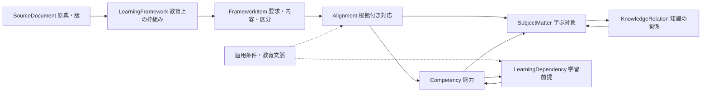

> 履歴資料：2026-09-28の初期設計と、その後に追記された当時の記録です。2026-10-11に現行文書から分離しました。実装状態や未決事項は[現行資料](../../README.md)を参照してください。

# ドメイン設計 v0.3 — 学校段階をまたぐ中核

> 2026-09-29：学年・教科、構造化根拠、目標と注釈、UUIDと改訂、AND/OR・資料種別は[契約0.2.0](../../exchange-contract-0.2.md)で実装。以下の0.1.0時点の検証・計画は履歴として残す。

更新日: 2026-09-28 / 状態: 比較・検証する設計案。名称や型を最終決定したものではない。

## 1. 今回変える境界

原構想の「Curriculum＝学習指導要領」を広げる。教育上の枠組みには国の基準、分野別の参照基準、大学・課程のカリキュラムや到達目標があり得る。大学の科目構成の実例は[東京大学の開講科目一覧](https://www.c.u-tokyo.ac.jp/info/academics/zenki/curriculum.html)、分野別参照基準の例は[日本学術会議](https://www.scj.go.jp/ja/member/iinkai/daigakuhosyo/daigakuhosyo.html)を参照。

原典の文書、教育上の枠組み、そこで要求される項目、学ぶ対象、獲得する能力を分ける。例えば、知識の「関数」は中1だけに属さず、学年や大学での位置付けを別の対応関係で表す。

図は責務の区別を示し、1対1関係や独立サービスの数を指定していない。

## 2. 中核モデルの案

| 仮名 | 役割 | 初期に必要な制約 |
|---|---|---|
| SourceDocument | 原典、解説、参照基準、シラバス等の出典・版・引用位置 | 原文と要約・解釈を区別。複数の資料を一つの枠組みの根拠にできる |
| LearningFramework | 発行主体、種類、適用範囲、版を持つ教育上の枠組み | 国・大学・課程等を発行主体にできる。法律上の効力を単一の強弱に変換しない |
| FrameworkItem | 枠組み内の要求、内容、見出し等 | 外部コードは任意。所属枠組みと原典の版・位置を持つ |
| SubjectMatter | 学ぶ対象の安定した識別、名称、説明、適用範囲 | 学年・学校種・文科省コードを必須属性にしない |
| Competency | 行動、対象、条件、達成の基準または観察指標 | 自動採点や一つの正解を必須としない。複数対象を参照できる |
| Alignment | 枠組み項目から知識・能力への対応 | 多対多、部分対応、対応理由、レビューを持つ。対応先の種類を明示 |
| KnowledgeRelation | 包含・一般化・表現・利用などの学問上の関係 | 種類ごとに向き・端点・対称性・推移性を定義 |
| LearningDependency | 特定条件・学習経路における能力の前提 | 必須、推奨、別経路を区別。履修規則を暗黙に混ぜない |
| Context / Provenance | 適用条件、枠組み、作成者、根拠、レビュー | MVPでは属性・小さな値型でよい。汎用推論エンジンを要求しない |
| DatasetRelease | 整理したデータの版・範囲・変更記録 | 原典版とスキーマ版を区別する |

Curriculum / CurriculumItemは旧案の名前。学習指導要領を表す具体的な種類や読み込み側で残せるが、中核を国の指導要領だけに限定しない。LearningFrameworkという名称自体も検証対象。

## 3. 学年、科目、履修順を知識の本体から外す

- SubjectMatterは複数の教育段階・分野で参照できる。
- 小6の比例と中1の比例で学ぶ対象を共有しても、扱う数や表現、期待する行動が違えば能力・条件を分ける。
- 高校の科目、大学の課程・コース、開講年度、履修条件は教育文脈側に置く。大学の「1年次」を全世界で同じ難易度とは扱わない。
- ある大学でAがBの履修条件でも、それだけで普遍的な学習前提A→Bを生成しない。
- 同じ内容が複数の科目に現れても、ラベルだけで同一・別物を判断しない。

全国の学年を一本に並べたレベル値を中核にせず、必要な段階情報は枠組み内の属性として扱う。すべての科目・学問を一つの木に押し込まない。

## 4. 分類をどう拡張するか

Concept / Statement / Procedure / Model / Representationの5分類は、数学・理科の初期語彙候補として残す。最初から全分野に網羅的・排他的な型と宣言しない。

**初期提案:** 共通の学習対象と型付き参照を持ち、分類を拡張可能な語彙として付ける。Statement等に必要な条件は個別に検証する。単なる自由記述の寄せ集めにも、何でも一つの巨大enumにも寄せない。

| 境界例 | 必要な区別 |
|---|---|
| 比例の概念／y=3xという特定例／そのグラフ画像 | 概念、数学的な表現、教材ファイル |
| 同じ語の異なる定義 | 定義の条件・立場・出典。意味が違うなら別IDを対応で結ぶ |
| 自然科学のモデル | 適用範囲・近似・仮定。あらゆる条件で真の命題とは扱わない |
| 歴史解釈・哲学的立場 | 出典を持つ主張・解釈・批判・根拠。相反する立場の併記をデータ破損としない |
| 語学の発話・文章作成 | 相手・目的・状況・達成基準。自動採点可能性を能力の条件にしない |

Statementを残す場合、原案の「正しいとされるもの」だけでは不十分。定義・定理・仮説・経験的主張・解釈等を区別し、数学なら成立条件、他領域なら立場・根拠・適用範囲を保持する案。ここで人文・語学の本格データ整備まで要求するわけではない。

## 5. 能力と大きな教育目標

「表を読む」と「根拠を挙げて解釈を論じる」はどちらも能力の候補。後者を小問の正誤だけへ還元しない。達成条件・観察指標を記述し、必要なら後段でルーブリックへ接続する。

「学びに向かう態度」のような広い目標はFrameworkItemとして原文を保存できる。すべての原典項目を直ちに測定可能なCompetencyに変換する制約は置かず、部分対応・検討中を許す。

達成条件が異なる能力の共有は慎重に行う。「比例を扱う」というラベルが同じでも、正の数量に限る場合と負の座標を含む場合を無条件に同一視しない。

## 6. 関係・根拠・衝突の扱い

各関係はID、端点、種類、文脈、根拠、判断理由、状態を持つ案。根拠は辺ごとに持つ。AとBの存在の根拠はA→Bの根拠を代替しない。

- 学習前提の向きは `前提能力 → 対象能力` として利用例で固定する。
- 厳密な必須前提だけを、選択した経路・文脈で循環検査する。相互補完・推奨・知識の一般的関連は別扱い。
- AND/OR条件が必要な例は保持する。初期に単純な辺だけを実装するなら、代替経路を二つの必須辺へつぶさず「未対応の構造」と明示する。
- 異なる編集者や教育経路の見解を、根拠付きで併記できることを検証する。矛盾を一つの世界共通グラフへ押し込まない。
- 原典の階層、知識関係、学習前提、機関の履修順にはそれぞれ別の意味を与える。

## 7. IDと版

内部IDは対象の安定した同一性を示し、ラベル・学年・原典コードと独立させる。文科省コード等は名前空間付き外部識別子として保持する案。機関の科目コードは機関・版の範囲で一意にする。

原典の告示・改訂、配布ファイル版、スキーマ版、独自データ版を別管理する。意味を変える修正は新しい版または別IDと移行関係で表し、既存リリースの意味を黙って変更しない。

未知と不要を区別する。大学の項目に文科省コードがないことは「欠落」ではない。未調査の前提がないことを「基礎能力である」と推論しない。

## 8. 閲覧用の編成を中核から分ける

章・節・表示順はReadingOutline / ReadingSection等の小さな編成データに置き、FrameworkItem / SubjectMatter / CompetencyをIDで参照する。原典の階層をそのまま唯一の閲覧順にしない。同じ対象を複数の章や別の閲覧順に置ける。最初は専用の教材本文モデルを導入せず、既存データのラベル・説明・条件・対応・出典を表示する。

粒度や分類は原典と教科書資料を参考に小標本で仮決定する。事前の全体確定は不要。ただし、分割・統合・意味の変更には新しい版と移行関係を記録する。章の並べ替えや表示名変更だけで中核の対象IDを変えない。詳しくは[閲覧・API仕様](viewer-api.md)。

## 9. 今実装しないもの

全分野の完成したオントロジー、任意の命題を検証する証明器、大学の履修管理、学習記録、習熟度、規格への完全準拠は後段。中核には将来の接続に必要な識別子・文脈・根拠を残す。

ValidationとAssessmentの命名分離は引き続き有力案。一般のソフトウェアテストや外部規格のTestを禁止する規則にはしない。

## 10. 編集用DBへの移行を見据えた扱い

将来のwiki編集では、データの正本をDBへ移し、ここで分けた責務を維持する。原典・独自編集、安定ID・リビジョン、レビュー・公開版を分け、同じ交換モデルと検証を通じて公開JSONを生成する。[移行方針](database-editing-plan.md)と[構造検証カタログ](../../sample-catalog.md)を参照。現時点でDB実装・製品選定は行っていない。
