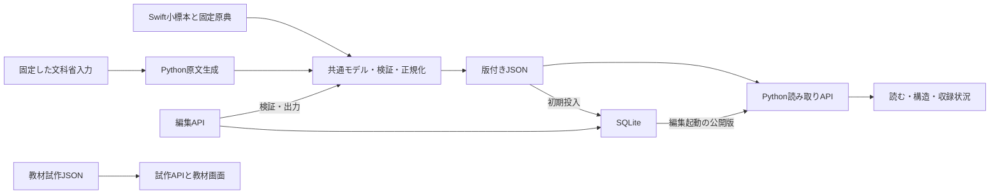

# 開発の引き継ぎ

確認日：2026-10-11。新しく開発に参加する人向けに、現在の構成、データの保存元、変更手順をまとめます。初期の実装前タスクは[保存版](history/design-2026-09-28/implementation-brief.md)にあります。

## 最初に確認する資料

[README](../README.md)で起動し、[要件](requirements.md)と[工程](milestones.md)で実装済み・作業中・未決定を確認してください。中核の変更には[モデル](domain-model.md)・[交換契約0.2.0](exchange-contract-0.2.md)、画面や取得処理には[API仕様](viewer-api.md)、保存には[ローカル編集](local-editing.md)を使います。

公開範囲の最終決定は[Issue #2](https://github.com/KantoYamamoto/Curricula/issues/2)で行います。推奨案を確定仕様として実装へ取り込まず、決定内容と影響する資料・契約・移行を記録します。

## 実装の構成



これは現行ローカル実装の構成です。外部公開時の構成図は[Issue #3](https://github.com/KantoYamamoto/Curricula/issues/3)で検討します。

| 場所 | 変更時に確認する責務 |
|---|---|
| [Package.swift](../Package.swift) | `Curricula`、`CurriculaPilot`、`CurriculaCLI`、`CurriculaTests` の構成 |
| [Sources/Curricula](../Sources/Curricula) | 共通モデル、型・参照・改訂・前提の検証、編集操作、正規化出力 |
| [Sources/CurriculaPilot](../Sources/CurriculaPilot) | 固定原典、UUID登録簿、Swiftの小標本 |
| [Sources/CurriculaCLI](../Sources/CurriculaCLI) | 生成と `check-json` 等のコマンド |
| [scripts/build_curriculum.py](../scripts/build_curriculum.py) | 固定原典から原文版・作業台帳を生成 |
| [scripts/serve.py](../scripts/serve.py)、[schema_v2_store.py](../scripts/schema_v2_store.py) | 版の読込、HTTPルート、属性・根拠の索引 |
| [scripts/editing_db.py](../scripts/editing_db.py)、[editing_api.py](../scripts/editing_api.py) | SQLite、不変版、下書き、競合、確認、編集API |
| [web](../web) | 閲覧、構造、収録状況、教材、編集の画面 |
| [Tests/CurriculaTests](../Tests/CurriculaTests)、[scripts](../scripts) の `test_*.py` | モデル、互換性、保存、API、データの検証 |

Swift 6.0以上、Python 3.10以上、標準ライブラリのみで動作します。通常の実行にネットワークは不要です。

## 変更の種類と手順

### 共通モデル・契約を変える

まず正常例、不正例、既存の境界例への影響を確認します。Swiftモデル・検証とPython読込・APIを揃え、必要なら新しいスキーマ版を設けます。公開済み0.1.0・0.2.0データの意味と読み取り結果は保持します。新しい要素を追加しただけで旧契約の未対応入力を成功扱いに変更しません。

### Swiftの小標本を変える

UUIDは[明示的な発行](identity-editing.md)で登録し、生成時に再発行しません。新しいデータ版を追加し、必要な変更記録を付けます。`make export` は既存の固定標本を再生成するためのコマンドです。出力差分が既存公開版を変える場合はそのまま採用せず、新版の入力と出力を追加します。

### 原文を取り込む

[収録仕様](curriculum-coverage.md)に従い、取得候補と既存入力を分けて、URL・配布版・ハッシュ・本文・階層の差分を確認します。固定入力を採用してから `make export-curriculum` で再生成します。独自の目標・根拠・確認記録を原典再取り込みで上書きしません。

### 対象・目標を整理する

`make serve-edit` で下書きを作り、原文から教育属性と根拠を選び、対象・目標・自然言語注釈を作ります。確認後に新しい版を保存し、確認した原文の範囲を記録します。公開版は `manage_db.py export`、進捗は `export-work` で書き出し、`data/authoring` と `data/work-reviews` に追加します。`.local` のDB・未公開下書きをGitに追加しません。

### 教材を変更する

[教材試作](learning-preview.md)の形式を使い、目標・原文への公開版と改訂参照を確認します。教材の変更を共通データの本文へ混ぜません。独立した問題の改訂や公開APIは[Issue #4](https://github.com/KantoYamamoto/Curricula/issues/4)・[#6](https://github.com/KantoYamamoto/Curricula/issues/6)で設計中です。

## 確認コマンド

```sh
make check
```

Swiftのビルド・テスト、Pythonのテスト、交換契約、全原文・台帳と小標本の再生成一致を確認します。モデルやAPIを変更した場合は関連する画面も起動して、取得失敗・空結果・原典と独自編集の表示・根拠の参照を確認します。確認対象の版と結果を記録し、古い検証記録の件数を現在の結果として引用しません。

文書だけの変更ではリンク・コマンド・仕様との一致を確認します。公開済みデータやコードを意図せず変えていないことも確認してください。

## 現在の次の作業

内容整理は小学校国語1・2年「話すこと・聞くこと」から続けます。設計は#2で利用者・初回公開範囲を決め、その内容を構成・教材モデル・保存・API・画面・運用のIssueへ反映します。[工程の一覧](milestones.md)を参照してください。
