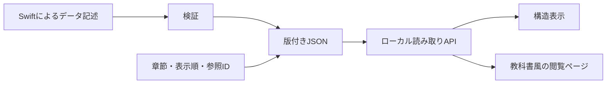

# 閲覧ページ・APIと段階的な設計 v0.3

> 実装開始後の状態：2026-09-28に初回増分を実装。以下はv0.3時点の計画であり、現在の確認範囲は[初回レビュー](reviews/pilot-0.1.0.md)を参照。

更新日: 2026-09-28 / 状態: 実装時に具体例で更新する初期案。実装済みではない。

## 1. 今回の合意

カリキュラムの構造表示とは別に、学習指導要領・知識・能力のデータを教科書風に読むページを設ける。両者はAPIを使って同じデータを表示する。既存教科書の本文・PDFの閲覧や、独立した説明教材の執筆は初期対象に含めない。

粒度・関係・ID・JSONの全仕様を実装前に確定しない。学習指導要領・解説・既存教科書の公開資料を手掛かりに妥当な初期案を作り、迷う具体例を調べながら改訂する。対象単元と前提の境界はアシスタントに選定を委任されている。

## 2. 二つの表示

| 表示 | 初期の内容 | 確認する価値 |
|---|---|---|
| 構造表示 | 枠組みの階層一覧、項目の詳細、対応する知識・能力・前提・出典へのリンク | 要求・対象・能力・関係を区別してたどれる |
| 教科書風の閲覧ページ | 目次、章・節、前後の節への移動、知識の説明、能力と条件、関連する原典と前提へのリンク | 同じデータを読みやすい順序で利用できる |

初期の構造表示は階層一覧と詳細でよい。自由配置のグラフ編集は不要。閲覧ページには原文・独自の説明・合成例を識別できる表示を置く。原典のコードなど詳細情報は必要時に参照できる形にする。

章立ての初期案は「数量の対応と比例」「表と式」「座標とグラフ」「表・式・グラフのつながりと適用条件」。前提の算数は関連リンクでたどる補助項目とし、全前提を同じ長さの章として執筆しない。

## 3. データと表示の境界

閲覧用の章節は中核の知識や能力をIDで参照する。同じ対象を複数箇所で表示しても、定義を複製して別々に修正する設計にしない。中核に画面の座標やHTMLを持たせない。数式など意味のある表現はデータに保持し、描画方法は画面側で扱う。

構造表示と閲覧ページは別ルート・別コンポーネントでよく、別サービスや別リポジトリは要求しない。Swiftはデータモデル・宣言・検証の出発点。ブラウザ側の技術選定は小標本を表示する最小構成を実装時に選び、全層をSwiftで書くという未確認の要件は追加しない。

## 4. APIの初期契約案

ローカルのHTTP読み取りAPIとして、JSONデータの版を指定して取得する。公開サーバーや認証・編集APIは初期対象外。下記のパスは仮案で、具体例に合わせて変更できる。

| リクエスト例 | 返す内容 |
|---|---|
| `GET /api/v1/releases` | 利用できるデータ版とスキーマ版 |
| `GET /api/v1/releases/{release}/frameworks/{id}` | 枠組みと項目の階層 |
| `GET /api/v1/releases/{release}/entities/{id}` | 対象・能力・原典項目の詳細と型 |
| `GET /api/v1/releases/{release}/relations?entityId=...&contextId=...` | 条件に合う対応・前提・関連 |
| `GET /api/v1/releases/{release}/reading-outlines/{id}` | 章節・表示順・対象IDへの参照 |

レスポンスにはデータ版とスキーマ版を含める。画面が一つの閲覧中に異なるデータ版を混在させない。存在しないID・未調査・該当なし・通信失敗を区別する。文脈を指定しない関係取得では文脈を保持した一覧を返し、すべてを普遍的な必須前提として統合しない。

初期は出力済みデータを読む実装でよく、データベースは必須にしない。APIのURL版、スキーマ版、データ版、原典版は役割が異なる。

## 5. 最小限だけ先に決める理由

先に必要なのは、小標本について「何を指すIDか」「どの種類の関係か」「どう表示へ渡すか」を揃えること。教科書の節と能力を1対1にする、掲載順を必須前提にする、画面の位置を対象IDにすると、後から意味や表示を変える際に修正箇所が増える。

変更可能な設計で対応できるが、変更が無費用になるわけではない。分割・統合時の参照更新、旧版の保持、表示・APIの整合確認は必要。汎用的な拡張機構を先に大量実装するより、小標本で必要になった変更を版・根拠・移行表とともに扱う。

初期の分解規則:

- 独立に参照・説明したい対象は知識として登録する。
- 行為、対象、条件、達成の観点が意味のある形で異なる場合は能力を分ける。細部は例を見て調整する。
- 原典の項目・教科書の章節・知識・能力の間は多対多を許す。
- 教科書の掲載順は編成の根拠とする。必須前提にするには、その能力を扱う経路上の理由を別に記録する。
- 判断保留や部分対応を許し、確証のない関係を必須へ格上げしない。

## 6. 段階的なレビューと受入例

小標本 → 構造とJSON → APIと二つの画面 → 対象範囲全体、の順に確認する。日常の機械検証・資料照合・小修正は継続して行い、ユーザーには意味のある増分を示す。専門家の手配は当面考えない。

- 同じ比例の知識が、構造表示と閲覧ページで同じID・版・内容を持つ。
- 章や節の順番を変更しても、知識・能力・前提の意味が変わらない。
- 関連する能力、原典、前提へAPI経由でたどれる。
- 部分対応、未調査、合成例を完全な実データと誤認しない。
- データ取得中・失敗・該当なしが画面で区別される。
- 一つの能力を分割する変更例で、旧版と新版の対応を確認できる。

レビュー記録は対象版・確認者（ユーザー／AI等）・観点・指摘・対応を残す。機械検証成功を内容の確認完了とは扱わない。
